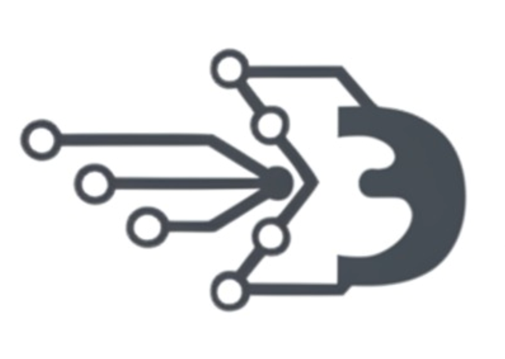
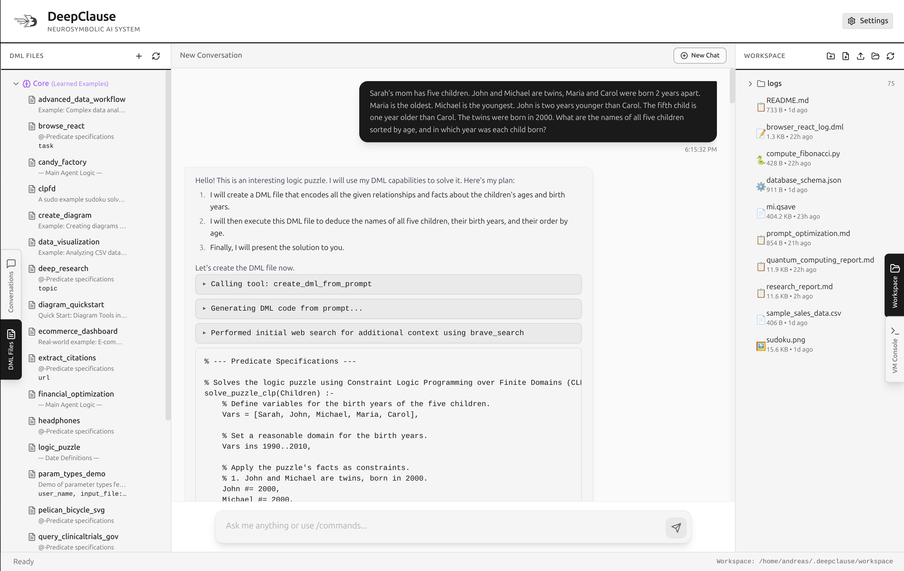
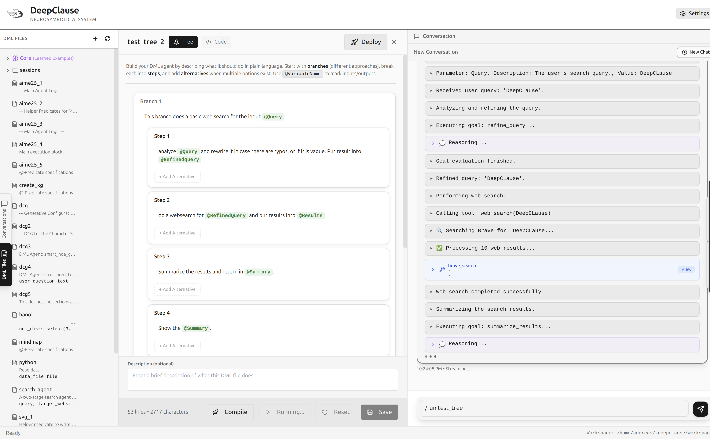
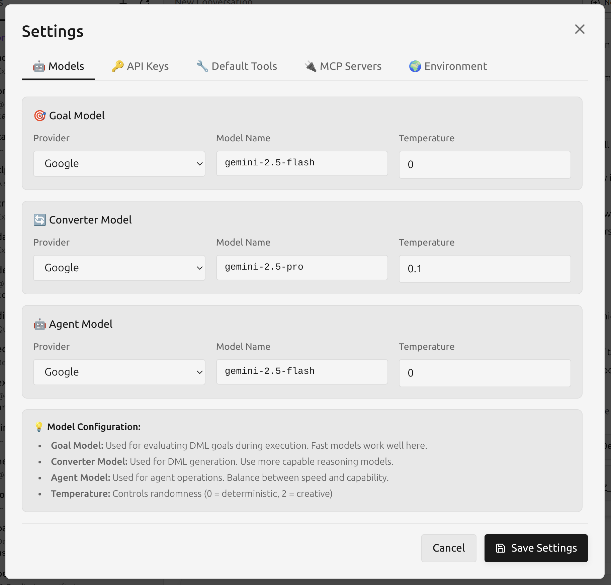
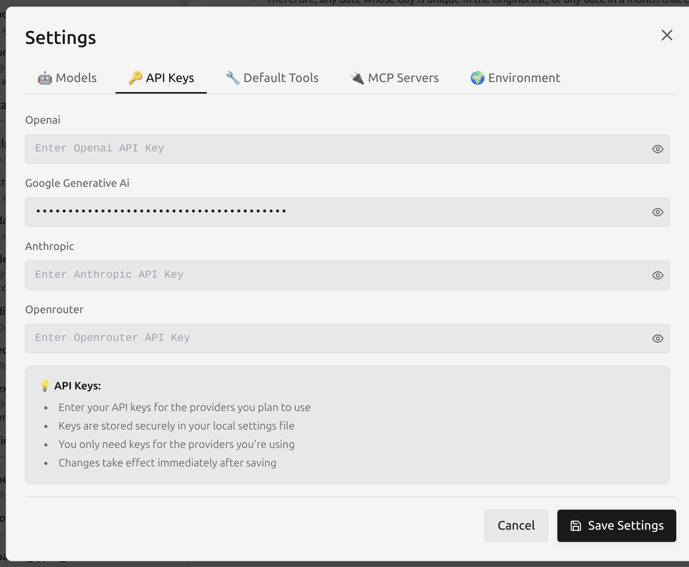

## This repository is not maintained anymore, please go to  [deepclause/deepclause-sdk](https://github.com/deepclause/deepclause-sdk)  for the latest version of deepclause.

# DeepClause - A Neurosymbolic AI System

<p align="center">
  
</p>

<p align="center">
  <strong>The Missing Logic Agent</strong><br/>
</p>




----

## Updates

- Deploy DML files as microapps with API for easy integration into workflows (click the rocket icon next to a DML file)
- [A DML implementation](docs/hanoi.dml) of the paper "Solving a Million-Step LLM Task with Zero Errors" ([arXiv:2511.09030](https://arxiv.org/abs/2511.09030)) 

- Structured edit mode to simplify writing DML code:



- Binaries not updated (still haven't gotten an Apple Developer ID to solve the code signing issue :-)

----

## What is DeepClause?

**DeepClause** is a **neurosymbolic Agentic AI system** that attempts to brudge the gap between symbolic reasoning and neural language models. Unlike pure LLM-based agents that struggle with complex logic, multi-step reasoning, and deterministic behavior, DeepClause uses **DML (DeepClause Meta Language)** - a Prolog-based DSL - to encode agent behaviors as executable logic programs.

The goal of this project is to allow users to build **accountable agents**. These are systems that are not only contextually aware (LLMs) and goal-oriented (Agents), but also logically sound (Prolog), introspectively explainable, and operationally safe. This integrated approach addresses the critical shortcomings of purely neural systems by embedding them within a framework of formal logic and secure execution, laying a principled foundation for the future of trustworthy autonomous systems.

## Hello World Example: Build a basic deep research agent in less than 5 minutes

1. Open the App

2. Open Settings, add API Keys and choose the underlying LLMs. Most of the development has been done based on a combination of Gemini 2.5. Flash and Pro. 






3. Create a new .md file with the following content in the workspace folder and save it as "prompt.md"

```
I'd like you to build a "Deep Research Agent". It should work as follows:

0. One parameter with a user topic/question.
1. Do an initial websearch to broadly understand the topic
2. Craft a small number of searches in order to find relevant content
3. Check if the content is generally enough to fulfill the request
4. Generate a structure and start writing all sections.
5. Finally synthesize a report, save it, then present a short summary to the user and mention the report saved in the file.

General Rules:
- Keep track and cite all sources (use [number] where number references to a source)
- Add a list of all sources at the end of the report.
```


4. Enter the following command in the chat input

```
/create :prompt.md
```

5. This will generate DML code that can be saved in a DML file (click the save button at the bottom of to the generated code in the chat window), as filename choose e.g. "myagent.dml"

6. Run the agent
```
/run myagent
```

For more examples in the form of some screen recordings please visit [deepclause.github.io](http://deepclause.github.io).

### Core Motivation

Modern LLMs excel at natural language understanding but fail at:
- ✗ Deterministic execution (same input → same output)
- ✗ Complex logical reasoning (constraint solving, formal verification)
- ✗ Verifiable, inspectable decision-making

Traditional logic programming (Prolog) excels at these but lacks:
- ✗ Natural language understanding
- ✗ Semantic reasoning over unstructured text
- ✗ Flexible adaptation to novel tasks

**DeepClause combines both paradigms**: Prolog handles the logical scaffolding, control flow, and symbolic reasoning, while LLMs provide natural language understanding, semantic extraction, and content generation.


## Inspiration and Acknowlegdments
This work has heavily been inspired the article ["Virtual Machinations: Using Large Language Models as Neural Computers"](https://queue.acm.org/detail.cfm?id=3676287). 

Additionally, we like to express our gratitude to the [SWI Prolog](https://www.swi-prolog.org/) Project in general and Jan Wielemaker in particular. Wihtout the decades of work that went into SWI Prolog, the development of DeepClause would not have been possible.

## What Makes DeepClause Different?

While this project is still at an early stage, several key design principles distinguish it from existing approaches:

- **Declarative Workflows Over Prompts**: DeepClause combines aspects of DSPy and CodeAct by encoding agent behavior in executable code rather than system prompts. Each workflow step has explicit input/output constraints, ensuring type safety (to some extent) and logical consistency. DML programs can be written by humans or generated dynamically by LLMs, enabling a "compile-then-execute" pattern—essentially "auto-generated DSPy in Prolog."

- **Sandboxed Execution Enables Safe Sharing**: DML runs within a custom meta-interpreter that maintains complete execution state tracking and enforces strict sandboxing. The tight coupling between symbolic code and LLM outputs makes prompt injections more likely to trigger recoverable errors than cause security vulnerabilities. **This security model allows DML files to be safely shared, versioned, and distributed—users can run community-contributed skills without risking system compromise, similar to how packages work in traditional programming ecosystems.**

- **Hybrid Memory Architecture**: DeepClause separates conversational memory from execution state. LLM calls only occur where semantically necessary, avoiding the context pollution common in pure chat-based agents. This architecture enables efficient handling of long-running tasks without degradation.

- **Native Support for Search and Backtracking**: Built on Prolog's execution model, DML naturally explores solution trees through backtracking. This makes it well-suited for implementing test-time compute strategies and multi-branch reasoning patterns.

- **Reproducibility as a First-Class Concern**: Once created, DML programs can be saved, parameterized, and re-executed with consistent logical behavior—a stark contrast to the non-deterministic nature of typical LLM agents. This enables debugging, version control, and reliable deployment.

- **Seamless Symbolic Integration**: As a Prolog-based system, DeepClause provides native interoperability with constraint solvers (CLP(FD), CLP(R)), knowledge graphs, theorem provers, and other symbolic reasoning tools.


## State of the Project (as of 11/2025)

- Very early pre-release binaries of the Desktop App for Mac OS (Arm), Linux x86-64 and Windows are available in the releases section.

- Core Prolog code is a mess :-)

- Known bugs and issues:
    - Aborting a running DML execution / agent session does not always work
    - Probably thousands of big and small bugs everywhere

- A pure CLI based version is currently in development, potentially with an MCP interface or another type of API. In case you are interested, please let us know how and if you would like to use DeepClause beyond the Desktop app.

- We are releasing this as at a very early stage in order to collect feedback and are hoping to incite interesting discussions in the AI researcher and developer community.

- We know our appraoch is somewhat unconventional, but somebody had to try it, I guess :-)

- This project has been mostly developed by a single person together with a Coding Agent. So we hope you won't mind the relatively large amount of LLM-generated documentation and Javascript code :-)

- **This is highly experimental software! Use at your own risk**

### Quick Introduction to the DeepClause Desktop-App

The **DeepClause Desktop Application** is an Electron-based development environment that provides an intuitive interface for creating, managing, and executing DML (DeepClause Meta Language) programs. The app features a modern chat-based interface where you interact with an intelligent agent that can discover existing DML skills, create new ones on-the-fly from natural language descriptions, and orchestrate complex multi-step workflows. The interface includes specialized panels for browsing your DML skill library, exploring workspace files, monitoring the embedded Linux VM console (V86 emulator), and managing conversation history.

Under the hood, the desktop app orchestrates a three-layer architecture: the **JavaScript/Node.js layer** (Electron main process) handles file I/O, settings management, and tool integration; the **WebAssembly layer** runs the SWI-Prolog WASM module for symbolic reasoning and DML execution; and the **sandboxed V86 Linux VM** provides isolated execution for Python scripts and bash commands. The agent system uses a hybrid planning approach—it first analyzes your request, searches for relevant existing DML files, determines if modifications or new skills are needed, then generates a multi-step execution plan. Each DML file can declare typed input parameters (file pickers, dropdowns, multi-select) that are automatically rendered as interactive input dialogs, and execution output is streamed in real-time with support for progress indicators, structured logs, and rich markdown rendering including embedded diagrams (Mermaid), code highlighting, and workspace file previews.


## 🎮 Desktop App Usage Guide

### Setup API Keys and Tools

Configure API Keys, tools and MCP servers in the Settings dialog (button on top right corner). Some tools may require setting some environment variables (also possible in the Settings Dialog).

### Natural Language Mode

Simply describe what you want to accomplish in natural language. The DeepClause agent will:
1. Analyze your request and search for relevant existing DML skills
2. Determine if existing skills can solve the task or if new ones are needed
3. Create an execution plan and either run existing DML files or generate new ones
4. Execute the plan and stream results in real-time

**Example**: "Research recent advances in quantum computing and create a summary report with citations"

### Slash Commands

For more direct control, use these commands in the chat interface:

- **`/run [skill.dml]`** - Execute a specific DML skill file
  - *Tip: Click any DML file in the left sidebar to auto-populate this command*
  
- **`/create [description]`** - Generate a new DML skill from a natural language description
  - *Example*: `/create Search for Python tutorials and extract the top 5 beginner-friendly resources`
  
- **`/explain`** - Get a detailed explanation of the last execution
  - Shows which decisions were made by symbolic logic vs AI/LLM
  - Provides reliability estimates and step-by-step breakdowns
  - Ideal for understanding, debugging, or learning how DML works
  
- **`/learn [skill.dml]`** - Add a skill to the agent's context for future reference
  
- **`/help`** - Display all available commands

### Interactive Parameters

When a DML skill requires input, interactive dialogs will appear automatically:
- **File pickers** for selecting workspace files
- **Dropdown menus** for single-choice options
- **Multi-select lists** for choosing multiple items
- **Text inputs** for custom values


---

## 🎯 DML Language Examples

[DML Reference Documentation](docs/dml_reference.md) (Work in progress)


### Example 1: Hello World

The simplest DML program:

```prolog
agent_main :-
    answer("Hello from DeepClause! 🎉").
```

**What happens**: 
- Entry point `agent_main` is called
- `answer/1` sends final response to user
- Execution completes

### Example 2: Web Search with LLM Extraction

Combine tool calling with semantic understanding:

```prolog
agent_main :-
    % Search the web
    tool(web_search("latest AI breakthroughs 2024"), Results),
    
    % Extract structured data using LLM
    extract_breakthroughs(Results, Breakthroughs),
    
    % Present findings
    format_report(Breakthroughs, Report),
    answer(Report).

% @-predicate: LLM-powered function
extract_breakthroughs(SearchResults, BreakthroughsList) :-
    @("From the SearchResults, extract a list of major AI breakthroughs. 
       Each item should include: technology name, organization, and key innovation.
       Return as a Prolog list of structured terms.").

% Standard Prolog predicate
format_report([], "No breakthroughs found.").
format_report([H|T], Report) :-
    format_report(T, RestReport),
    format(string(Report), "• ~w\n~w", [H, RestReport]).
```

**What happens**:
1. `tool(web_search(...), Results)` - JavaScript layer calls web search API
2. `extract_breakthroughs(...)` - WASM layer delegates to LLM via `@-predicate`
3. `format_report(...)` - Prolog recursively builds formatted output
4. `answer(Report)` - Final response streamed to UI

### Example 3: Multi-Branch Reasoning

Implement robust fallback strategies:

```prolog
agent_main :-
    % Branch 1: Try Google Scholar for academic sources
    tool(google_scholar_search("quantum computing", 10), Papers),
    Papers \= "",  % Verify we got results
    analyze_papers(Papers, Analysis),
    answer("Academic Analysis:\n\n{Analysis}").

agent_main :-
    % Branch 2: Fallback to general web search
    log("Scholar search failed, using web search"),
    tool(web_search("quantum computing research"), Results),
    summarize_findings(Results, Summary),
    answer("Web Summary:\n\n{Summary}").

agent_main :-
    % Branch 3: Last resort - provide general information
    answer("I apologize, but I couldn't access current research. 
            However, I can explain quantum computing concepts if helpful.").
```

**What happens**:
- DeepClause tries Branch 1 first
- If Branch 1 **fails** (scholar search returns empty), **backtracks** to Branch 2
- If Branch 2 **succeeds**, execution **stops** (Branch 3 never tried)
- Branch 3 always succeeds - guarantees graceful degradation

### Example 4: OCR + Sudoku - Constraint Logic Programming

Solve combinatorial problems declaratively:

```prolog
% Standard CLP(FD) Sudoku solver
parse_sudoku_string_to_prolog(String, List) :-
    @("You are given a string containing a sudoku in the format `[[5,3,0,0,7,0,0,0,0], [6,0,0,1,9,5,0,0,0], ...]`, 
    please parse this into a valid prolog list term and output it in the List variable.
    Do not use 0 for blank fields, instead use an underscore to denote a blank field.").

format_solved_grid(SolvedGrid, MarkdownGrid) :-
    @("Take the `SolvedGrid`, which is a list of lists of numbers (1-9), and format it into a clean, 
    human-readable markdown table representing the Sudoku board. Add separators for the 3x3 blocks. 
    The output `MarkdownGrid` should be a single markdown string.").

% Sudoku solver using Constraint Logic Programming over Finite Domains (CLP(FD))
% This is a standard, well-known Prolog implementation for solving Sudoku.
sudoku(Rows) :-
    % Ensure the grid is 9x9
    length(Rows, 9),
    maplist(same_length(Rows), Rows),
    % Flatten the grid into a single list of variables
    append(Rows, Vs),
    % The domain for each variable is 1 to 9
    Vs ins 1..9,
    % All numbers in each row must be unique
    maplist(all_distinct, Rows),
    % Transpose the grid to get columns, and ensure they are also unique
    transpose(Rows, Columns),
    maplist(all_distinct, Columns),
    % Define the 3x3 blocks and ensure they are unique
    Rows = [A,B,C,D,E,F,G,H,I],
    blocks(A, B, C),
    blocks(D, E, F),
    blocks(G, H, I),
    % Find a valid assignment of numbers to the variables
    maplist(labeling([ff]), Rows).

% Helper for the solver: defines the 3x3 block constraint
blocks([], [], []).
blocks([N1,N2,N3|Ns1], [N4,N5,N6|Ns2], [N7,N8,N9|Ns3]) :-
    all_distinct([N1,N2,N3,N4,N5,N6,N7,N8,N9]),
    blocks(Ns1, Ns2, Ns3).

% Main agent logic

% Branch 1: Successful image recognition and solving
agent_main :-
    param("image_path:file", "The path to the image file containing the Sudoku puzzle.", ImagePath),
    ( ImagePath \= "" -> true ; (log(error="The 'image_path' parameter is missing."), fail) ),
    log(task="Attempting to solve Sudoku directly from the image: '{ImagePath}'."),

    % Step 1: Use the visualizer tool to perform OCR and extract the grid
    log(task="Analyzing image to extract the puzzle grid and numbers."),
    tool(visualizer(ImagePath,"Identify the Sudoku grid. Perform 
            Optical Character Recognition (OCR) on each cell. 
            Represent the grid as a Prolog list of lists, where each inner list is a row. 
            Use the integer 0 to represent empty cells. The output `SudokuGrid` must be in this 
            format, for example: `[[5,3,0,0,7,0,0,0,0], [6,0,0,1,9,5,0,0,0], ...]`. 
            If a valid 9x9 grid cannot be reliably extracted, then output nothing"), ToolOutput),

    parse_sudoku_string_to_prolog(ToolOutput, UnsolvedGrid),
    ( UnsolvedGrid \= [] ->
         log(task="Successfully extracted the grid from the image.")\ 
    ; 
        (log(error="Could not recognize a valid Sudoku grid in the image."), fail) 
    ),

    yield("Grid = {UnsolvedGrid}"),

    % Step 2: Solve the puzzle using the CLP(FD) solver
    log(task="Solving the puzzle..."),
    sudoku(UnsolvedGrid), % This predicate solves the grid by unifying the variables
    log(task="Puzzle solved successfully."),

    % Step 3: Format the solved grid into a markdown table
    log(task="Formatting the solution for display."),
    format_solved_grid(UnsolvedGrid, SolvedGridMarkdown),

    end_thinking,
    system("You are a helpful assistant that has just solved a Sudoku puzzle from an image for the user."),
    observation("I have successfully analyzed the image, extracted the puzzle, and found the solution."),
    observation(SolvedGridMarkdown),
    chat("Please give me the solution to this Sudoku.").

```

**What happens**:
- SWI-Prolog's CLP(FD) solver finds valid Sudoku solution
- No brute-force search needed - constraint propagation guides search
- Solution guaranteed to satisfy all constraints


### Example 5: Python and file reading with file selecto dialog

Execute complex computations in isolated VM:

```prolog
agent_main :-
    param("data_file:file", "Select CSV dataset", DataFile),
    
    % Read data
    read_file_to_string(DataFile, CSV, []),
    
    % Generate Python analysis script
    Script = {|string||
import pandas as pd
import matplotlib.pyplot as plt
from io import StringIO

# Read CSV from stdin
df = pd.read_csv(StringIO('''~w'''))

# Statistical analysis
stats = df.describe().to_json()
print(stats)

# Create visualization
df.plot(kind='bar')
plt.savefig('analysis.png')
|},
    format(string(FullScript), Script, [CSV]),
    
    % Execute in VM
    tool(vm_exec(FullScript), StatsJSON),
    
    % Parse and present results
    atom_json_dict(StatsJSON, Stats, []),
    answer("Analysis complete! 📊\n\n\n\nStatistics: {Stats}").
```

**What happens**:
1. User selects CSV file via file picker
2. Prolog reads file content
3. Multi-line Python script generated with quasi-quotation `{|string||...|}` 
4. Script executed in sandboxed Linux VM (no host access)
5. Results parsed and displayed with embedded chart

### Example 6: Explainability

After running any skill, use `/explain` to understand what happened:

```bash
User: /run deep_research.dml
[... execution output ...]

User: /explain
```


---

## 📚 Documentation

- **[DML Language Reference](docs/dml_reference.md)** - Complete guide to DML syntax, built-in predicates, and execution model
- **[Architecture Security](docs/dml_reference.md#security-benefits-of-the-three-layer-architecture)** - Deep dive into the three-layer isolation model
- **Example Skills** - See `src/electron/initial_examples/*.dml` for 20+ working examples

---

## 🛠️ Development Setup

### Prerequisites

- **Node.js** v18+ and npm
- **Git**

### Installation

```bash
# Clone the repository
git clone https://github.com/apfadler/DeepClauseCLI.git
cd DeepClauseCLI/wasm

# Install dependencies
npm install

# Download the Alpine Linux VM image (required for vm_exec tool)
# Download from: https://drive.google.com/file/d/1gyV4Xfn-s9JSV_nThe-fhKO5886OmEmf/view?usp=sharing
# Place the downloaded alpine.img file in: vendor/v86/images/alpine.img


### Running in Development

```bash
# Start vite
npm run dev:vite

# Start the Electron app in development mode
npm run electron:dev
```

This will start both the Vite dev server for the renderer process and the Electron main process with hot reload enabled.


### Building

```bash
# Build for current platform
npm run build

# Build for specific platforms
npm run build:linux
npm run build:mac
npm run build:win
```

Binaries will be output to `dist/`.

### CLI Installation (Global)

The DeepClause CLI can be installed globally to make the `deepclause` command available in your shell:

```bash
# From the repository root
npm link

# Now you can run DeepClause from any directory
deepclause
```

Or install directly from npm (when published):

```bash
npm install -g deepclause-cli-wasm
```

#### CLI Directory Structure

The CLI uses the following directories:

- **`~/.deepclause/`** - Global DeepClause directory
  - `settings.json` - API keys and model configuration
  - `dml_examples/` - Global DML examples library
  - `dml_examples/learned/` - User's learned/saved DML skills
  - `mi.qsave` - Prolog saved state
  - `config.json` - MCP server configuration

- **`./.deepclause/`** (optional) - Per-project local overrides
  - `dml_examples/` - Project-specific DML examples

#### Path Resolutionmain

When running `/create`, `/run`, or `/learn` commands, the CLI searches for DML files in this order:
1. Local `./.deepclause/dml_examples/` (if exists in current directory)
2. Global `~/.deepclause/dml_examples/`

This allows project-specific DML customizations while maintaining global defaults.

#### CLI Usage

```bash
# Show help
deepclause --help
deepclause -h

# Start the interactive CLI
deepclause

# Headless mode: execute a command and exit
deepclause -x "<prompt>"
deepclause --execute "<prompt>"
```

#### Headless Mode

The `-x` (or `--execute`) flag runs a single command or prompt and exits immediately. This is useful for scripting and automation:

```bash
# List available DML files
deepclause -x "/list"

# Run a specific DML file
deepclause -x "/run myagent.dml"

# Generate new DML code
deepclause -x "/create a web search agent"

# Run a natural language prompt
deepclause -x "Search for Python tutorials and summarize the top results"
```

#### Interactive Commands

# Or run via npm
npm run cli
```

Inside the CLI:
- `/create <description>` - Generate new DML from description
- `/run <filename>` - Execute a DML file
- `/save <filename>` - Save generated DML
- `/learn <filename>` - Copy DML to learned examples
- `/list` - List available DML files
- `/explain` - Explain last execution
- `/help` - Show all commands

### Contributing

DeepClause is in active development. Contributions welcome! Areas of focus:

1. **New Tool Integrations** - Add tools to `src/dml-js/tools.js`
2. **Example Skills** - Create `.dml` examples showcasing interesting use cases
3. **Documentation** - Improve guides, tutorials, API docs
4. **Running Benchmarks** - Where are DeepClause's strength and weaknesses, what can we do better?

and many more!

Please open issues for bugs or feature requests.

---

## 🎓 Research & Background

DeepClause builds on decades of research in:

- **Logic Programming**: Prolog (1972), constraint logic programming
- **Neurosymbolic AI**: Combining neural networks with symbolic reasoning
- **LLM Agents**: ReAct, Chain-of-Thought, tool-augmented language models
- **WebAssembly**: Sandboxed execution, portable bytecode

---


## 📜 License and ## Third-Party Components

MIT License

This project also includes:
- **SWI-Prolog** (BSD-2-Clause) - https://www.swi-prolog.org/
- **V86** (BSD-2-Clause) - https://github.com/copy/v86

---

## 🙏 Acknowledgments

DeepClause stands on the shoulders of giants:

- **SWI-Prolog** team for the incredible Prolog system and WASM port
- **V86** project for JavaScript x86 emulation
- **Vercel AI SDK** for LLM streaming abstraction
- **Model Context Protocol** for standardized tool integration
- The entire **logic programming** and **neurosymbolic AI** research communities

---

## 📧 Contact

- **E-Mail**: andreas (at) deepclause.ai
- **GitHub**: [github.com/deepclause/deepclause-desktop](https://github.com/deepclause/deepclause-desktop)
- **Issues**: [github.com/deepclause/deepclause-desktop/issues](https://github.com/deepclause/deepclause-desktop/issues)

